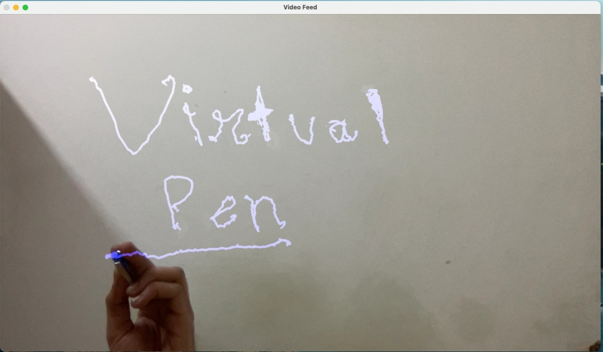

# Virtual-Pen

It contains two parts:
1. Optimising the Color Range for the Marker
2. Drawing/Writing on the Virtual Drawing Board

**Optimising the Color Range:**
- When the virtualpen.py is run, the first pop up shows two feeds:
i. The Original Video Feed
ii. The Mask showing only the region according to the adjustments of HSV values

- Try getting only the marker as the white patch. To achieve this, vary only H values initially, and then S and V values
- Once the marker patch hsv values are chosen, click **enter or esc or change the save trackbar to 1**. 

**Drawing/Writing** 

- The Drawing sheet will appear. 
- Moving the marker will draw the required shapes or text.
- Press **C** (clear) to clear the board
- Press **H** (hold) to not draw anything
- Press esc to exit the program

**Demo Pic**

